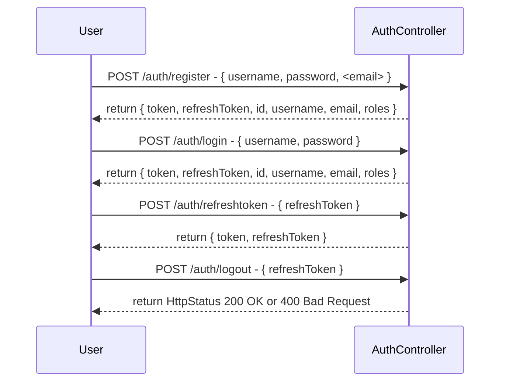

[](https://github.com/xBlizZer/demoAuth/actions)


## Getting Started

### Prerequisites

To run this application, you need the following installed on your system:

- Java 17
- Maven
- Spring-Boot Version: 3.0.5

### Installation

1. Clone this repository: `git clone https://github.com/johnwati/test-accounts-api`
2. Navigate to the project directory: `cd test-accounts-api`
3. Run the application: `mvn spring-boot:run`

# Usage


## Auth API
The Auth API allows users to register with a username and password, and their registration data is stored in an H2 memory database. After a successful registration, users receive their user data, a JWT token, and a refresh token.

The API supports role-based authorization, meaning that certain endpoints require specific roles to access. Users can use the JWT token to authenticate themselves and access the protected endpoints.

If the JWT token expires, users can use the refresh token to generate a new JWT token. However, if the refresh token expires, users will need to log in again through the user interface to obtain a new set of tokens.

Note: When using the dev profile, test users are automatically generated. One example test user is the username Jonas with the password Test, and they have the roles ROLE_ADMIN and ROLE_MEMBER.

Please refer to the API documentation or consult with the system administrator for further details on the registration process, authentication requirements, available endpoints, and the roles required to access them.

### Registration

To register a new user, make a `POST` request to the `/auth/register` endpoint with a JSON body containing the `username`, `password` and `email` (optional) fields:

```json
{
  "username": "your_username",
  "password": "your_password",
  "email": "your_email"
}
```

If the registration is successful, the server responds with a JSON object containing the user data, JWT token, and refresh token:

```json
{
  "token": "Created JWT Token",
  "refreshToken": "Created Refresh Token",
  "id": 1,
  "username": "your_username",
  "email": "your_email",
  "roles": []
}
```
### Login Authentication
To authenticate a user and obtain a JWT token, make a `POST` request to the `/auth/login` endpoint with a JSON body containing the `username` and `password fields:

```json
{
  "username": "your_username",
  "password": "your_password"
}
```

If the credentials are valid, the server responds with a JSON object containing the user data and JWT token:

```json
{
  "token": "Created JWT Token",
  "refreshToken": "Created Refresh Token",
  "id": 1,
  "username": "your_username",
  "email": "your_email",
  "roles": []
}
```

### Accessing Protected Endpoints
To access protected endpoints that require role-based authorization, include the JWT token in the Authorization header of your requests with the Bearer prefix, like this:

`Authorization: Bearer your_jwt_token`

If the JWT token is valid and the user has the required role, the server will process the request accordingly. If the JWT token expires, you can use the refresh token to generate a new JWT token (see next section).

#### Example Protected Endpoint

To access a protected Endpoint, make a `GET` request to the `/auth/roles` endpoint with `Authorization: Bearer your_jwt_token`

Required Role is: `ROLE_ADMIN`

### Handling Expired Tokens

#### Expired JWT Token

If the JWT token expires, you request a new JWT token with your stored Refresh Token
Just make a `POST` request to the `/auth/refreshtoken` Endpoint

```json 
{
  "refreshToken": "Your stored Refresh Token"
}
```

If the Refresh Token is valid, the server responds with a JSON object containing the new JWT token and your current RefreshToken

```json 
{
  "token": "New created JWT Token", 
  "refreshToken": "Your stored Refresh Token"
}
```

#### Expired Refresh Token
If the JWT token expires, you need to re-login at the `/auth/login` endpoint to obtain a new JWT token.

# Accounts API

The Accounts API provides endpoints for managing user accounts. It allows authorized users to perform operations such as retrieving, creating, updating, and deleting accounts.

## Base URL

https://api.example.com


## Authentication

The Accounts API uses token-based authentication. To access the protected endpoints, include an `Authorization` header in your requests with a valid access token. The access token should be obtained through the authentication process.

## Error Responses

The API returns standard HTTP status codes to indicate the success or failure of a request. In case of an error, additional information may be provided in the response body, including an error code and a message describing the error.

## API Endpoints

### Get All Accounts

Retrieve a paginated list of all user accounts.

- URL: `/accounts`
- Method: GET
- Required Role: ROLE_ADMIN
- Query Parameters:
    - `page` (optional): Specifies the page number for pagination. Default is 0.
    - `size` (optional): Specifies the page size for pagination. Default is 10.

#### Request

```http
GET /accounts?page=0&size=10
Authorization: Bearer <access_token>
```
Response
```http
HTTP/1.1 200 OK
Content-Type: application/json

{
  "accounts": [
    {
      "id": 1,
      "name": "John Doe",
      "email": "johndoe@example.com",
      "account_number": "1234567891"
    },
    {
      "id": 2,
      "name": "Jane Smith",
      "email": "janesmith@example.com",
      "account_number": "9876543210"
    },
    ...
  ],
  "page": 0,
  "size": 10,
  "totalAccounts": 25
}
```
## Get Account by Number or Name
Retrieve an account based on either the account number or account name.


    URL: /accounts/filter
    Method: GET
    Required Role: ROLE_ADMIN
    Query Parameters:
    accountNumber (optional): Specifies the account number for filtering.
    accountName (optional): Specifies the account name for filtering.
    Request
```http
GET /accounts/filter?accountNumber=1234567891
Authorization: Bearer <access_token>

```
Response
```http
HTTP/1.1 200 OK
Content-Type: application/json

{
  "id": 1,
  "name": "John Doe",
  "email": "johndoe@example.com",
  "account_number": "1234567891"
}
```
## Get Account by ID
Retrieve an account by its unique identifier.

    URL: /accounts/{id}
    Method: GET
    Required Role: ROLE_ADMIN
    Path Parameter:
    id: Specifies the ID of the account to retrieve.
Request

```http
GET /accounts/1
Authorization: Bearer <access_token>
```
Response
```http
HTTP/1.1 200 OK
Content-Type: application/json

{
  "id": 1,
  "name": "John Doe",
  "email": "johndoe@example.com",
  "account_number": "1234567891"
}
```
## Create Account
Create a new user account.

    URL: /accounts
    Method: POST
    Required Role: ROLE_ADMIN
    Request Body: AccountDTO
Request

```http
POST /accounts
Authorization: Bearer <access_token>
Content-Type: application/json

{
  "name": "John Doe",
  "email": "johndoe@example.com",
  "account_number": "1234567891"
}
```
Response

```http
HTTP/1.1 201 Created
Content-Type: application/json

{
  "id": 1,
  "name": "John Doe",
  "email": "johndoe@example.com",
  "account_number": "1234567891"
}
```
## Update Account
Update an existing user account.

    URL: /accounts/{id}
    Method: PUT
    Required Role: ROLE_ADMIN
    Path Parameter:
    id: Specifies the ID of the account to update.
    Request Body: Account
Request

```http
PUT /accounts/1
Authorization: Bearer <access_token>
Content-Type: application/json

{
  "name": "John Doe",
  "email": "johndoe@example.com",
  "account_number": "9876543210"
}
```

Response


```http
HTTP/1.1 200 OK
Content-Type: application/json

{
  "id": 1,
  "name": "John Doe",
  "email": "johndoe@example.com",
  "account_number": "9876543210"
}
```
## Delete Account
Delete an existing user account.

    URL: /accounts/{id}
    Method: DELETE
    Required Role: ROLE_ADMIN
    Path Parameter:
    id: Specifies the ID of the account to delete.
Request

```http
DELETE /accounts/1
Authorization: Bearer <access_token>
```
Response
```http
HTTP/1.1 204 No Content
```
### Conclusion
The Accounts API provides endpoints for managing user accounts. With the appropriate authentication and authorization, you can perform operations such as retrieving accounts, creating new accounts, updating existing accounts, and deleting accounts.

Please refer to the API documentation or consult with the system administrator for further details on the request format, expected responses, and authentication requirements.


Please note that you may need to replace `<access_token>` with the actual access t
If you would like to contribute to this project, please fork the repository and submit a pull request with your changes.

### License

